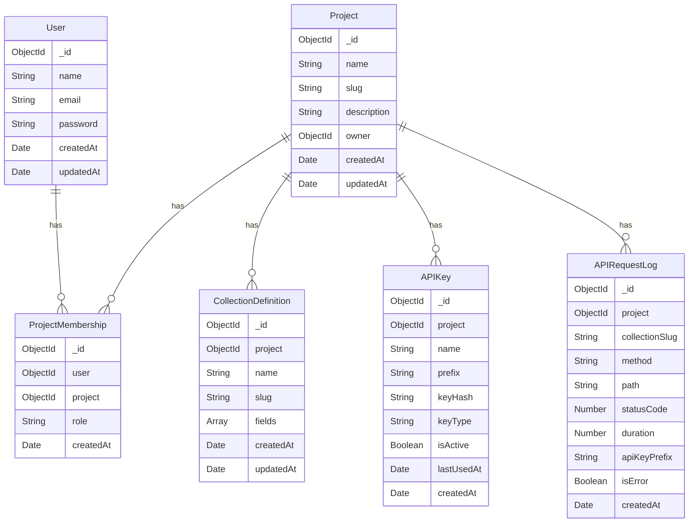
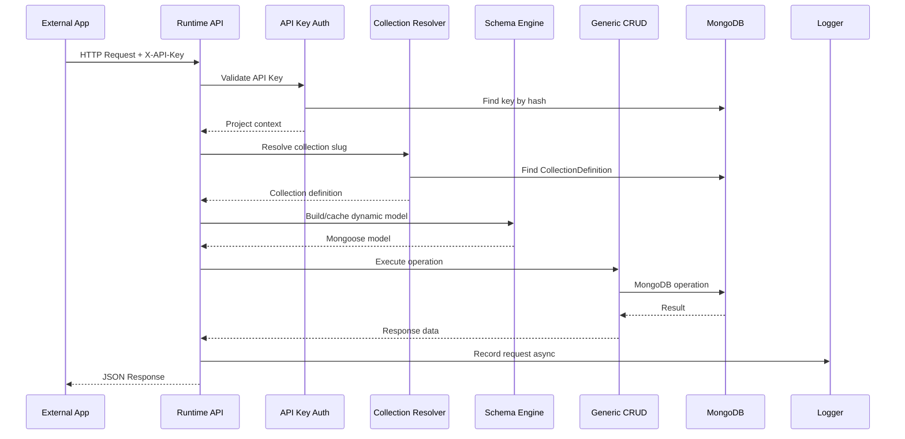

# Backend Forge — Architecture Document

## Overview

Backend Forge is a schema-driven Backend-as-a-Service (BaaS) platform. Developers define data models through a management API/dashboard, and Backend Forge dynamically exposes secured RESTful CRUD APIs for those models.

---

## Multi-Tenancy Data Storage Decision

### Evaluated Options

| Criteria | Option A: Separate Collections | Option B: Shared Record Store | Option C: DB-per-Tenant |
|---|---|---|---|
| Tenant Isolation | Physical separation | Logical (projectId filter) | Full isolation |
| Dynamic Mongoose Models | Natural fit — one model per collection | Awkward — single model, dynamic validation layer | Overkill |
| Indexing | Standard per-collection indexes | Compound indexes on projectId + fields | Standard |
| Collection Count | Grows with tenants × collections | Fixed (1 collection) | Grows with tenants |
| Query Performance | Direct — no tenant filter needed | Every query must include projectId | Direct |
| Schema Flexibility | Each collection has its own schema | Generic `data` field, harder to index inner fields | Full flexibility |
| Operational Complexity | Moderate — many collections | Low — few collections | High — many databases |
| MongoDB Limits | ~24,000 namespaces default (sufficient for MCA scope) | No limit concern | Connection pool explosion |

### Decision: Option A — Separate Physical Collections

**Chosen approach:** `data_{projectId}_{collectionId}`

Where `collectionId` is the immutable MongoDB `_id` of the `CollectionDefinition` document — not the mutable slug. This ensures collection renames never cause data loss or orphaned collections.

**Rationale:**
1. **Natural Mongoose fit:** Each user-defined collection maps to a real MongoDB collection with a dynamically constructed Mongoose schema. This is the cleanest demonstration of dynamic schema/model creation.
2. **Physical tenant isolation:** Project A's `products` and Project B's `products` live in different MongoDB collections. No risk of cross-tenant data leakage through a missing `projectId` filter.
3. **Indexing:** Standard MongoDB indexes work naturally on each collection's fields.
4. **Interview defensibility:** Demonstrates understanding of dynamic model compilation, caching, and MongoDB collection management.
5. **MCA scope:** The expected scale (hundreds, not millions of collections) is well within MongoDB's namespace limits.

**Limitations:**
- Collection count grows linearly with `tenants × collections_per_tenant`.
- MongoDB's default namespace limit (~24,000) is sufficient for demonstration but would need monitoring at scale.
- Schema modifications require careful model cache invalidation.

**Future Migration Path:**
- Monitor collection count. If approaching limits, implement collection archival for inactive projects.
- For true enterprise scale, migrate to Option B with compound indexes, or Option C with connection pooling.
- MongoDB Atlas supports higher namespace limits.

### Dynamic Model Caching Strategy

```
Request arrives → resolve projectId + collectionId
                        ↓
              Check model cache (Map)
               key: `${projectId}_${collectionId}`
                        ↓
                 Cache hit? → Use cached model
                 Cache miss? → Load CollectionDefinition from DB
                                    ↓
                              Build Mongoose schema from field definitions
                                    ↓
                              Compile model (mongoose.model())
                                    ↓
                              Store in cache → Use model
```

Cache invalidation: When a collection's schema is updated, remove its entry from the model cache. Next request rebuilds it.

Process restart: Cache is empty; models are rebuilt lazily on first access.

---

## Two API Systems

### Management API (Dashboard)
- **Auth:** JWT (Bearer token)
- **Routes:** `/api/auth/*`, `/api/projects/*`, `/api/projects/:projectId/collections/*`, etc.
- **Purpose:** User registration, login, project CRUD, schema management, API key management, logs, analytics, members.

### Runtime Data API (External Applications)
- **Auth:** Project API Key (`X-API-Key` header)
- **Routes:** `/api/v1/:projectId/:collectionSlug` (project ID in URL for unambiguous routing)
- **Purpose:** CRUD operations on dynamic collections from external apps.

### Why projectId in Runtime URL?
API keys are project-scoped, but including projectId in the URL:
1. Makes routing explicit and unambiguous.
2. Allows future multi-project keys if needed.
3. Matches common BaaS URL patterns.

---

## API Key Security Model

### Secret Server Keys
- Generated with crypto.randomBytes (32 bytes → 64 hex chars)
- Prefixed: `bf_sk_` (Backend Forge Secret Key)
- **Stored:** Only bcrypt hash stored in DB
- **Displayed:** Raw key shown exactly once at creation
- **Use:** Server-to-server communication (trusted environments)

### Public Client Keys (Future)
- Prefixed: `bf_pk_`
- Limited permissions (read-only, rate-limited)
- For browser/mobile usage
- **Not implemented in Phase 1** — documented as future enhancement
- Requires security rules engine for safe browser access

---

## RBAC Model

| Permission | Owner | Admin | Developer | Viewer |
|---|---|---|---|---|
| Delete project | ✅ | ❌ | ❌ | ❌ |
| Transfer ownership | ✅ | ❌ | ❌ | ❌ |
| Manage members | ✅ | ✅ | ❌ | ❌ |
| Manage API keys | ✅ | ✅ | ❌ | ❌ |
| Manage collections/schemas | ✅ | ✅ | ✅ | ❌ |
| Use API Explorer | ✅ | ✅ | ✅ | ❌ |
| View logs | ✅ | ✅ | ✅ | ✅ |
| View analytics | ✅ | ✅ | ✅ | ✅ |
| View project settings | ✅ | ✅ | ✅ | ✅ |
| Update project settings | ✅ | ✅ | ❌ | ❌ |

---

## Database Models



---

## Request Flow — Runtime API



---

## Supported Field Types (10+)

1. **string** — Text data. Options: required, default, minLength, maxLength, trim, enum
2. **number** — Floating point. Options: required, default, min, max
3. **integer** — Whole numbers. Options: required, default, min, max
4. **boolean** — true/false. Options: required, default
5. **date** — ISO 8601 dates. Options: required, default (now)
6. **email** — Validated email strings. Options: required, unique
7. **url** — Validated URL strings. Options: required
8. **enum** — Constrained string values. Options: required, enumValues, default
9. **array** — Arrays of items. Options: required, itemType, minItems, maxItems
10. **object** — Nested key-value. Options: required (stored as Mixed)
11. **reference** — ObjectId reference. Options: required, refCollection
12. **decimal** — Precise decimal (Mongoose Decimal128). Options: required, default, min, max

---

## Directory Structure

```
BackendForge/
├── src/
│   ├── config/           # DB connection, env validation
│   ├── middleware/        # Auth, RBAC, rate-limit, error handler, security
│   ├── models/           # Mongoose models (User, Project, etc.)
│   ├── routes/           # Express route definitions
│   ├── controllers/      # Request handlers
│   ├── services/         # Business logic
│   ├── utils/            # Helpers, constants
│   └── app.js            # Express app setup
├── tests/                # Automated tests
├── docs/                 # Documentation
├── server.js             # Entry point
├── package.json
├── .env.example
├── .gitignore
└── README.md
```

---

## Key Indexes

| Model | Index | Reason |
|---|---|---|
| User | `email` unique | Prevent duplicate accounts, fast lookup |
| ProjectMembership | `{ user, project }` unique | One membership per user per project |
| CollectionDefinition | `{ project, slug }` unique | Prevent duplicate collection names per project |
| APIKey | `{ prefix, isActive }` | Fast API key lookup by prefix during runtime auth |
| APIKey | `{ project, isActive }` | List active keys per project |
| APIRequestLog | `{ project, createdAt }` | Paginated log queries per project |
| APIRequestLog | `{ project, method }` | Analytics by method |
